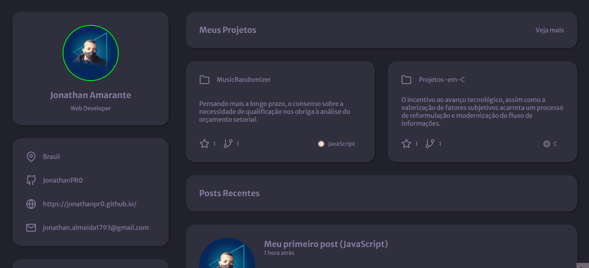

# Portfolio



Esse portifólio foi desenvolvido levando em consideração os dados de estilização fornecidos no desafio "Portfolio" da **Rocketseat**. Ele vai um pouco mais além, fazendo uso não apenas do _HTML_ e do _CSS_ como também de _JavaScript_ e _Node.js_, o que tornou o projeto mais dinâmico

### 👨‍💻 Tecnologias

- HTML
- CSS
- SASS
- JavaScript
- Node.js
- Handlebars

### 🎲 Rodando o Back End (servidor)

```bash
# Clone este repositório
$ git clone <https://github.com/JonathanPR0/rocketportifolio>

# Instale as dependências
$ npm install

# Execute a aplicação
$ npm start

# O servidor inciará na porta:3000 - acesse <http://localhost:3000>
```

### 😀 Autor


Feito por Jonathan Amarante 👋🏽 Entre em contato!

<a href = "mailto:jonathan.almeida1793@gmail.com"></a>
<a href="https://www.instagram.com/jonathan.pr0/" target="_blank"></a>
<a href = "https://t.me/Jon_PR0"></a>
